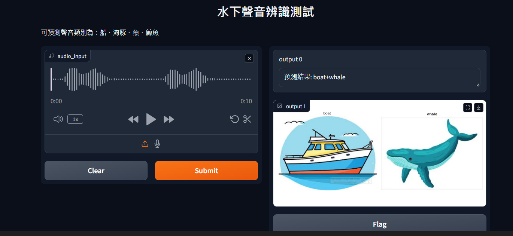

## Aqua Sound Classification  
This is a research plan that trying to determine the sounds from which ocean creature.  
:bangbang: Dataset are not provided to Public. :bangbang:  

在本次Project中，先嘗試如何處理資料、並訓練模型(分為`Mult-label`和`Mult-Classification`兩種)。  
See My Note for more detail: https://hackmd.io/cO-vSEYfTOmX7vWbR_TeZw  

📁 Vitis- AI  
Check manual for more detail: https://docs.amd.com/r/en-US/ug1414-vitis-ai/Vitis-AI-Overview  
目前嘗試使用Vitis-Ai檢視量化後的模型結果，作為初步結果。  
* 表現上還是以分類模型較優。 (2024/10/14)  
* 更動Mult-label使其表現優良。 (2024/10/15)  

Update: add tensorflow version of our model.  
You can other source code about this project, please check that [ocean-sound-project-ubuntu proposed by AnnTaiwan](https://github.com/AnnTaiwan/ocean-sound-project-ubuntu/tree/main)

📁 gradio  
A simple GUI implemented by `Gradio`.  
A user can upload the audio and push `sumbit` buttom, the user will get the predicted result from the model with text and image explanation.  
Note: it is just a simple test, currently not working for the final demo version.
